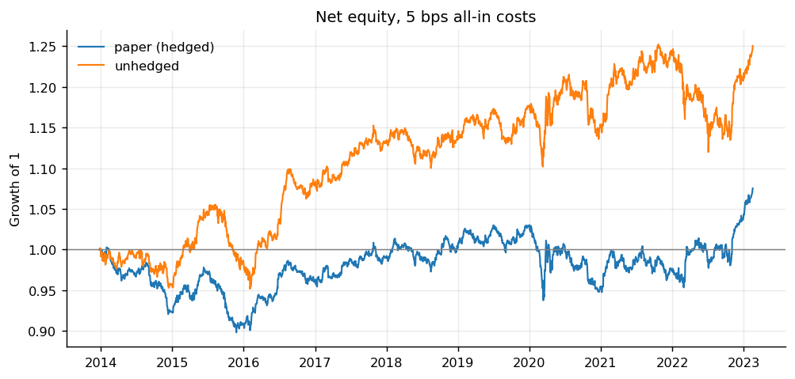
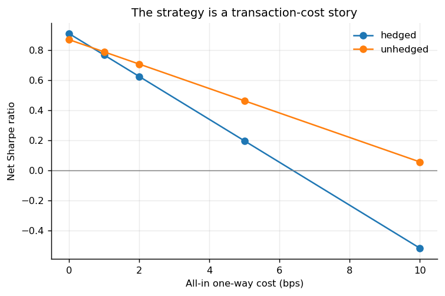
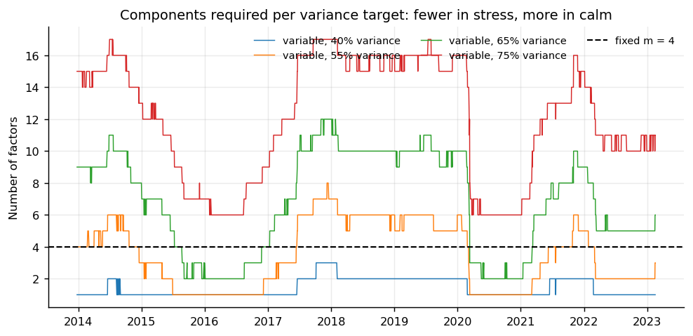
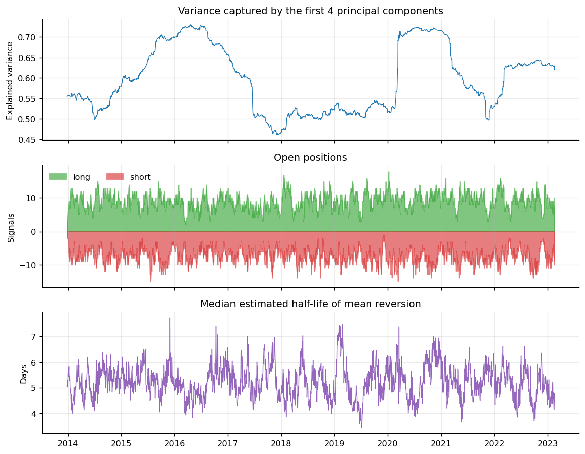

# Statistical arbitrage on the Euro Stoxx 50

A from-scratch implementation of the PCA strand of Avellaneda & Lee, *Statistical
Arbitrage in the U.S. Equities Market* (2008), applied to the 50 Euro Stoxx
constituents over 2013–2023.

The strategy decomposes each stock's return into a systematic part, spanned by
eigenportfolios of the return correlation matrix, and an idiosyncratic residual.
The cumulative residual is modelled as an Ornstein–Uhlenbeck process; when a
stock's residual strays far enough from its equilibrium, the strategy bets on
reversion and hedges the position's factor exposure.

The point of this repository is not that the strategy makes money — net of
realistic costs it barely does. The point is the measurement: which of the
paper's design choices survive transplantation to a different market, a
different decade and a universe 28 times smaller, and which do not.

---

## Headline result

2014–2023 (the first year is consumed by the estimation window), daily
rebalancing, 5 bps all-in one-way costs.

| | Gross Sharpe | Net Sharpe | Net return | Volatility | Max drawdown | Turnover /yr |
|---|---|---|---|---|---|---|
| Paper construction (factor-hedged) | 0.91 | 0.20 | 0.8% | 4.5% | −10.4% | 64 |
| Same signals, no factor hedge | 0.87 | **0.46** | 2.4% | 5.5% | −10.6% | 45 |



A gross Sharpe near 0.9 matches what the paper reports for its PCA strategies
over 2003–2007, which is reassuring: the signal transplants. What does not
transplant is the cost budget. At 5 bps the strategy spends between 2.2% and
3.2% a year in fees against a volatility of 4.5–5.5%, so most of the gross
Sharpe is consumed at the execution layer.



| Cost | 0 bps | 1 bps | 2 bps | 5 bps | 10 bps |
|---|---|---|---|---|---|
| Hedged | 0.91 | 0.77 | 0.63 | 0.20 | −0.52 |
| Unhedged | 0.87 | 0.79 | 0.71 | 0.46 | 0.06 |

The paper's 5 bps was a 2008 assumption for US mid-caps. For Euro Stoxx
large-caps executed with a standard algo today, 1–2 bps is closer to reality,
and at that level the strategy is a genuine if modest 0.6–0.8 Sharpe.

---

## Does each of the paper's design choices earn its place?

Every row changes exactly one decision relative to the paper's configuration.

| Variant | Gross Sharpe | Net Sharpe |
|---|---|---|
| **Paper construction** | **0.91** | **0.20** |
| No factor hedge | 0.87 | 0.46 |
| No centring of the equilibrium level *m* | 0.67 | −0.04 |
| Modified s-score, with drift | 0.56 | −0.16 |
| Symmetric exits at 0.50 | 0.76 | 0.10 |
| Execution at the close of the following day | 0.74 | 0.03 |
| Equal gross exposure instead of fixed notional | 1.02 | 0.22 |
| No AR(1) validity bound | 0.90 | 0.18 |
| Kendall bias correction on the AR(1) | 0.15 | −0.65 |
| No no-trade band | 0.82 | −0.04 |

Four of the paper's choices replicate cleanly:

* **Centring *m*** (equation 18) is worth 0.24 of gross Sharpe. Avellaneda and
  Lee justify it as removing model bias, since stocks should be fairly priced in
  aggregate; the data agrees.
* **The pure s-score beats the drift-adjusted one** by 0.35. Section 4.2 calls
  the drift effect "minor" and quietly declines to report modified-score
  backtests; on this universe it is not minor, it is actively harmful. The
  course assignment mandates the modified score, which is the wrong call.
* **Asymmetric exits** — closing shorts at 0.75 but longs at 0.50 — are worth
  0.15 over symmetric exits at 0.50. This was calibrated on US equities in
  2000–2004 and still holds on European equities in 2014–2023.
* **Trading at the close of the signal day** beats waiting one day by 0.17. The
  edge decays fast, as one expects from a one-day-horizon reversal signal.

### Entry threshold

| s_open | 1.00 | **1.25** | 1.50 | 2.00 |
|---|---|---|---|---|
| Gross Sharpe | 0.53 | **0.91** | 0.66 | 0.44 |
| Signals held | 20.8 | 16.6 | 12.2 | 4.9 |

The paper's 1.25 is the interior optimum, on a different continent and a
different decade from where it was calibrated. Entering earlier buys more trades
of worse quality; entering later leaves the book too empty to diversify.

---

## Three findings beyond the paper

### 1. The factor hedge is exact, and too expensive

Opening a long in stock *i* means buying a dollar of the stock and selling
β_ij dollars of each eigenportfolio *j*. Since the eigenportfolios are
themselves baskets of the same stocks, the hedge folds back into stock weights:
`w = q − P Bᵀq`.

That direct form is an *exact* projection, not an approximation. Writing Σ for
the covariance matrix over the regression window, the factors are `F = R P`, so
`Cov(R, F) = Σ P` and `Var(F) = diag(λ)`, giving `B = Σ P diag(λ)⁻¹` and hence
`Bᵀ P = diag(λ)⁻¹ Pᵀ Σ P = I`. The residual factor exposure after hedging is
zero to machine precision, which the test suite asserts.

The hedge does its job: volatility falls from 5.5% to 4.5%, and it improves the
gross Sharpe from 0.87 to 0.91. But the loadings and the eigenportfolios are
re-estimated daily, so the hedge basket churns even on days when no signal
changed. Turnover rises from 45 to 77 times a year. At 5 bps that is 1.6% of
extra annual cost to buy 0.04 of gross Sharpe.

A no-trade band — hold an existing weight until the target has moved far enough
to be worth the round trip — recovers 0.24 of net Sharpe and is the default
here, but it does not close the gap. **On a 50-name universe the theoretically
correct construction loses to the crude one.** The paper's 1400-name universe
had far more residual variance to harvest per unit of hedging cost.

### 2. The κ > 8.4 filter barely filters

The filter is supposed to keep only stocks whose residual reverts within half
the 60-day estimation window. OLS on a near-unit-root AR(1) is biased towards
zero by roughly (1 + 3b)/T, which on 59 usable pairs is about 0.07 — enough to
turn a random walk into an apparent week-long mean-reverter.

Simulating pure random walks, for which κ = 0 and which should never be traded:

| Window length | 60 | 120 | 252 | 504 |
|---|---|---|---|---|
| False positives, raw | **77%** | 55% | 19% | 3% |
| False positives, Kendall-corrected | 34% | 21% | 8% | — |

This is not a bug in the implementation; it is a property of the paper's
estimator that the paper does not discuss. It shows up in the backtest
diagnostics, where 47.6 of 48 assets pass the filter on a typical day.

### 3. Fixing the bias destroys the strategy

Correcting the bias cuts the false positive rate from 77% to 34% — and the gross
Sharpe from 0.91 to 0.15.

The honest reading is that the alpha does not come from residual stationarity.
Because the regression forces the cumulative residual to end at zero, the
s-score collapses to `s = −m / σ_eq` (equation 22 of the appendix): it is a
normalised measure of recent idiosyncratic drift, that is, a short-term reversal
signal wearing an Ornstein–Uhlenbeck costume. Making the O-U estimator
statistically sound removes exactly the small-sample distortion that the signal
was exploiting. Both behaviours are pinned down by tests, so the weakness is
documented rather than hidden.

---

## Factor selection

Avellaneda and Lee use 15 components on ~1400 US stocks, which corresponds to
roughly 50% of explained variance. Copying the number rather than the principle
would be a mistake here: on 50 highly correlated European large-caps, the first
component alone explains 46% on average, and 15 components would push well past
75% — the level at which the paper itself reports steady losses (figure 26),
because too little residual variance is left to pay for the trading.

| | Gross Sharpe | Net Sharpe | Mean *m* | Mean explained variance |
|---|---|---|---|---|
| **Fixed m = 4** | **0.91** | 0.20 | 4.0 | 59.6% |
| Variable, 40% target | 0.58 | 0.15 | 1.4 | 49.6% |
| Variable, 55% target | 0.81 | **0.24** | 3.5 | 57.5% |
| Variable, 65% target | 0.50 | −0.34 | 6.8 | 66.1% |
| Variable, 75% target | 0.70 | −0.37 | 12.0 | 75.8% |

Everything at or above a 65% target loses money net of costs, which reproduces
the paper's conclusion on a different universe. The 40% target degenerates: it
resolves to a single component on 62% of dates, which is the CAPM case the paper
associates with weak reversion and poor Sharpe.



The count needed for a given variance target moves inversely with market stress
— one component suffices in 2016 and 2020, six are needed through the calm of
2018–2019. That is figure 20 of the paper, reproduced on European data.



---

## Trading time (section 6)

Weighting returns by inverse relative volume, `R̄ = R · ⟨δV⟩ / V_t`, so that a
move on a quiet day counts for more than one on a heavy day.

| | Net Sharpe, calendar | Net Sharpe, trading time |
|---|---|---|
| Hedged | 0.197 | 0.195 |
| Unhedged | 0.464 | 0.438 |

No improvement, and slightly deeper drawdowns. This agrees with the paper, which
found the trading-time adjustment helps ETF-based signals markedly but "does not
lead to a significant improvement" for PCA-based ones.

---

## Deviations from the paper, and why

| Choice | Here | Paper | Reason |
|---|---|---|---|
| Factor count | 4 fixed | 15 fixed | 4 gives ~60% explained variance on 50 names, the paper's own target range |
| Sizing | fixed notional Λ = 5% | Λ for 2+2 leverage | same scheme, different scale; no leverage assumption needed |
| Rebalancing | no-trade band of 50 bps | none stated | the paper adjusts notional only on new positions (footnote 8); a band is the general form |
| Dividends, financing | ignored | modelled | total-return indices are used, and the risk-free rate nets out of a dollar-neutral book |
| Borrow costs | ignored | ignored | see limitations |

The course assignment this started from specifies a few things differently — the
modified s-score, no centring of *m*, symmetric exits, execution one day later,
no factor hedge. Each of those is measured in the design table above; all but
the last make the strategy worse.

---

## Limitations

* **Survivorship bias.** The universe is the *current* Euro Stoxx 50 membership
  held fixed over the whole period, because point-in-time membership was not
  available. Names that dropped out of the index are absent, and they are
  disproportionately the ones that did badly. This inflates every number here.
  A production version needs point-in-time membership.
* **No borrow costs.** Short positions are free in this simulation. On
  Euro Stoxx large-caps general collateral is cheap, of the order of 20–50 bps a
  year, but hard-to-borrow names are not, and the book is half short.
* **A flat cost model.** Costs are linear in turnover. A square-root market
  impact model, `σ · √(Q/V)`, would be more realistic, and this repository has
  the volume data to fit one.
* **Cross-market holidays.** Prices are forward-filled across local market
  holidays, producing an artificial zero return on roughly 2–3% of observations
  for some names. `statarb.data.coverage_report` quantifies this per asset.
* **Multiple testing.** Roughly thirty configurations were evaluated on one
  dataset. The design table should be read as description, not as a selection
  procedure; nothing here was held out.

---

## Repository layout

```
statarb/
  config.py        StrategyConfig: one frozen dataclass fully describing a backtest
  data.py          loading, point-in-time estimation windows, trading-time returns
  pca.py           eigendecomposition, eigenportfolios, sign alignment
  factor_model.py  factor extraction and the vectorised multi-factor regression
  ou.py            AR(1) -> Ornstein-Uhlenbeck mapping, validity filters, simulation
  signals.py       s-score and the entry/exit state machine
  portfolio.py     sizing, factor hedging, no-trade band
  backtest.py      execution lag, PnL, turnover, costs
  metrics.py       performance statistics
  strategy.py      the walk-forward loop tying it together
tests/             44 tests, all on independently known answers
scripts/
  run_experiments.py  regenerates every table in results/
  make_figures.py     regenerates every figure from those tables
notebooks/
  01_research.ipynb   narrative walkthrough of one estimation date
```

### Design notes

**Vectorisation.** All assets share one design matrix in the factor regression,
so the 50 regressions are a single `lstsq` solve; the AR(1) has a closed form
applied column-wise across the cross-section. A full 2346-day backtest runs in
34 seconds rather than the tens of minutes a per-asset loop would take.

**Walk-forward by construction.** Every window is built as
`returns.loc[:rebalance_date]`, so no future data can leak in. The execution lag
is an explicit parameter rather than a buried `.shift()`, because the difference
between lag 1 and lag 2 is worth 0.17 of Sharpe on this strategy.

**Tests assert facts, not outputs.** Each test checks something knowable
independently of the code: the trace of a correlation matrix equals *N*;
eigenvectors are orthonormal and reconstruct the matrix; eigenportfolio returns
are mutually uncorrelated; residuals are orthogonal to the regressors and
cumulate to zero at the window end; O-U parameters are recovered from an exactly
simulated process; the vectorised AR(1) matches a loop of scalar regressions; the
state machine satisfies a hand-written truth table; the hedge drives factor
exposure to zero.

## Data

The market data is not distributed with this repository: the Euro Stoxx 50
total-return index levels, daily volumes and GICS sector mapping come from a
licensed terminal. `data/README.md` documents the expected schema — a `Date`
index and one column per ticker — so the files can be dropped in from any
comparable source.

Everything that does not depend on that data is here: the full result tables in
`results/`, the figures they produce, and an executed notebook with its outputs.
The test suite runs unchanged on a fresh clone, since all 44 tests are built on
simulated or hand-constructed series rather than on the market files.

---

## Running it

```bash
git clone https://github.com/<user>/statarb-avellaneda-lee.git
cd statarb-avellaneda-lee
python -m venv .venv && source .venv/bin/activate
pip install -e ".[dev]"

pytest                              # 44 tests, ~1 second
python scripts/run_experiments.py   # ~8 minutes, writes results/
python scripts/make_figures.py      # writes results/figures/
```

A single backtest:

```python
from statarb.config import StrategyConfig
from statarb.data import compute_returns, load_prices
from statarb.strategy import run_strategy

returns = compute_returns(load_prices("data/sx5e_underlyings.csv"))
result = run_strategy(returns, StrategyConfig(no_trade_band=0.005))

print(result.summary())
print(result.diagnostics.tail())
```

Any variation is one keyword away, and `StrategyConfig` is frozen so a result can
be stored next to the exact configuration that produced it:

```python
unhedged = StrategyConfig(no_trade_band=0.005, hedge_factor_exposure=False)
cheap = unhedged.variant(transaction_costs=2e-4)
```

---

## Reference

Marco Avellaneda and Jeong-Hyun Lee, *Statistical Arbitrage in the U.S. Equities
Market*, 2008. The PCA strand is implemented here; the ETF strand is not.

Data: daily total-return index levels and traded volume for the Euro Stoxx 50
constituents, 2013-01-02 to 2023-02-17, in EUR.
